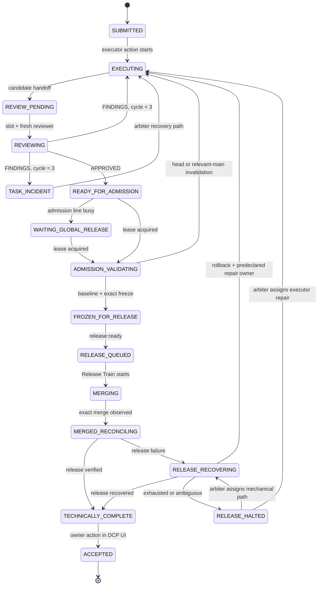
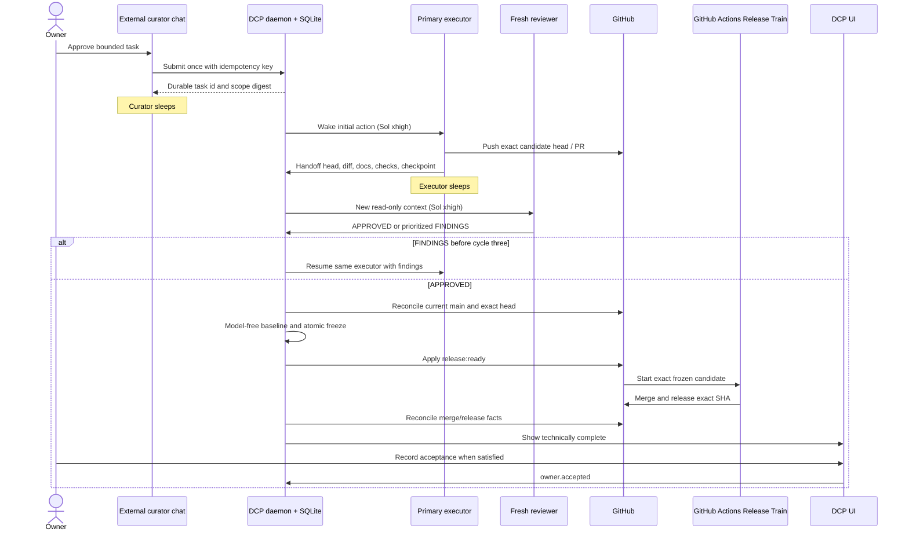

# DCP v1 target architecture contract

contract_status: target-design-only
contract_version: dcp-v1
recorded_at: 2026-08-08

This document is the agreed target architecture for a future DCP v1. It is a
design contract, not an operating contract and not evidence that any described
component exists. The current operating contour is the packaged I12/I13
foundation defined by [Current operating contract](CURRENT_OPERATING_CONTRACT.md).
Its approved managed source is pinned at commit
`2fbd9bf4789a5b388fb12c58d9347968ed06e6de`; the installed runtime remains on
the first Stage 2 source until deterministic correction replacement. I11
implements durable task identity, SUBMITTED state/event persistence, restart
recovery and display. I12 separately implements only one bounded stock
automatic reviewer for an existing worker/PR plus one exact synthetic
`dcp-review-lab` terminal merge after current approved/check/provider gates;
the target's general task execution,
multi-cycle review, arbiter, admission, release and incident machinery below
remains design-only.

The later bounded [real repo-only target v1 contract](DCP_REAL_TARGET_V1_CONTRACT.md)
separately authorizes one exact target and supersedes this document only for
that tuple. Its reviewed managed source is PR #57 merge
`f94b0603916c410419654ca4752ffa9084116ff8`, tree
`11a9856ea2504ef923221a97064a59a762a99ed8`; it is not runtime authority before
the separate immutable pin and deterministic stopped installation succeed.

The later bounded
[`wb-core` Release Train handoff contract](DCP_WB_CORE_RELEASE_TRAIN_HANDOFF_V1_CONTRACT.md)
separately authorizes only that exact repo-only tuple and preserves the WBC
GitHub Actions Release Train as sole merge/release actor. Its reviewed managed
source is PR #62 merge `99e8243ac66bfdd7e77538368403d0a3b5964c21`, tree
`81b391c80eef98c5723340a1da8e42a3da1bbaec`; it remains compatibility-locked
and outside runtime authority until the separate pin and deterministic stopped
installation complete.

Nothing beyond the explicit I11 and I12 slices and that exact terminal exception
authorizes a daemon or SQLite change, additional reviewer cycle, arbiter,
admission controller, queue, release automation, model call, installation,
Telegram adapter, real repository, production system or hosted service unless
the current operating contract records a separate owner-approved bounded stage.
The 2026-08-11 I13 authorization does so only for its exact two-task mechanical
admission Stage 1 and a contingent fresh-executor arbiter Stage 2; it activates
neither until each applicable implementation is merged, pinned and qualified.
Where this target differs from the installed runtime, the current operating
contract continues to govern until an implemented contract explicitly
supersedes it.

## 1. Invariants and non-goals

The target is one local desktop control plane, not a federation of services.
These invariants are normative:

1. The DCP Orchestrator daemon and its existing SQLite are the only local
   authority for task, attempt, review, admission and incident state. Admission,
   reconciliation and model-slot allocation are modules in that daemon, not
   separate services.
2. There is no Watcher, registry, scheduler service, queue service, reviewer
   service or recovery service. Durable states plus events in SQLite replace
   polling agents and in-memory ownership.
3. GitHub is authoritative for repository refs, pull requests, checks, merge
   and deployment facts. The Release Train is a model-free GitHub Actions
   workflow. DCP records reconciled GitHub facts but does not redefine them.
4. A future server may expose a read-only projection of DCP and GitHub facts.
   It cannot accept commands, mutate local state or become a failover authority.
5. The curator is an ordinary external ChatGPT or Mac chat. It submits one
   approved task once, receives a durable task id and sleeps. It does not poll,
   supervise or carry workflow state. Reverse delivery to chat is an optional
   later adapter and is not required for correctness.
6. Working status, HumanGate decisions and owner acceptance live in the DCP UI.
   Technical completion never creates owner acceptance. Only the owner can
   record acceptance.
7. A task has one primary executor identity and one worktree. Findings wake the
   same executor. A successor is created only after the daemon proves the prior
   executor lost or degraded, and it starts from a durable checkpoint rather
   than a transcript.
8. Models run only for execution, semantic review and arbitration. Admission,
   Release Train, waiting, monitoring, reconciliation and restart recovery are
   model-free.
9. Waiting is durable state, not a running process. No waiting state has a
   timeout. A timeout applies only to a currently leased action.
10. DCP never silently changes model, widens scope, uses a second worktree for a
    task, or lets one task repair another task's release incident.

Telegram, auto-update, a hosted write API, production rollout, `wb-core`, real
targets and upstream state import are outside this contract.

### Symphony provenance boundary

DCP continues to borrow only the architecture principles recorded from the
pinned Symphony specification in [Decisions](DECISIONS.md): one authority
serializes mutations; dispatch is idempotent; attempts have explicit phases and
terminal reasons; reconciliation precedes new work; active-action retry is
bounded and backs off; restart recovery uses authoritative facts; workspaces
are contained by normalized-root checks; and cleanup is explicit and
observable.

Symphony is provenance, not a dependency. DCP does not adopt or require the
Symphony runtime, service, code, issue polling, Codex App Server integration,
workflow watcher or scheduler. I9 does not install, invoke or test Symphony.
Any later comparison against a new Symphony revision is a documentation review,
not an update channel or implementation import.

## 2. Authority boundaries

| Fact or decision | Write authority | Evidence consumed by DCP | Prohibited alternate authority |
| --- | --- | --- | --- |
| Task identity, approved task text and scope digest | DCP daemon transaction in existing SQLite | Curator submission and later owner UI actions | Chat history, worker transcript or a separate registry |
| Attempt, executor identity, checkpoint and worktree binding | DCP daemon/SQLite | Process facts, Git facts and executor handoff | tmux status alone, model claims or an in-memory scheduler |
| Review cycles, verdicts and findings | DCP daemon/SQLite | Signed structured reviewer result bound to exact head/diff | PR comments alone, prior reviewer transcript or executor self-review |
| Admission state, frozen head/base pair and release-line lease | Mechanical Admission Controller module in the DCP daemon | Exact GitHub refs/checks plus model-free local baseline | Executor labels, reviewer labels or a separate admission service |
| Incident state, recovery owner and recovery path | DCP daemon/SQLite | Mechanical recovery evidence and arbiter decision where required | Ad hoc task intervention or chat status |
| Branch/head, pull request, CI, merge and deploy facts | GitHub | GitHub API/webhook reconciliation by exact repository and SHA | Cached local refs or DCP projection treated as primary |
| `release:ready` label | Admission Controller after successful validation and freeze | Frozen admission record | Executor, reviewer, curator or arbiter directly applying the label |
| Release Train execution | GitHub Actions | Exact frozen head/base, required checks and label | A model agent, auto-updater or desktop polling loop |
| HumanGate answer | Authorized human through DCP UI | Gate reason, allowed class and requested action | Chat reply, model inference or timeout |
| Owner acceptance | Owner through DCP UI | Exact technically completed task/release facts | Merge, deploy, agent text or curator synthesis |
| Optional history/provenance publication | Provider-neutral adapter, explicitly enabled after separate approval | Compact immutable refs/digests copied from authoritative facts | Provider becoming task/event, admission, release or recovery authority |
| Future server projection | Read-only projector | DCP and GitHub authoritative facts | Server-side commands or independent state |

SQLite mutations are serialized by the daemon. A state transition and its
event record commit in one transaction. GitHub facts are accepted only after
exact-repository and exact-SHA reconciliation; webhooks are hints that trigger
reconciliation, not authority by themselves.

## 3. Roles and lifetimes

### Curator

The curator supplies the approved immutable task text, scope and repository to
one idempotent submission. A successful receipt contains the task id and scope
digest. The curator then sleeps. Duplicate submission with the same idempotency
key returns the same task; a different payload under that key fails closed.

### Executor

The task owns one primary executor and one contained worktree. The executor is
event-driven: initial dispatch, proven reviewer findings, approved scope change
or assigned incident recovery may wake it. A finished candidate produces a
structured handoff with exact head SHA, diff digest, relevant documentation,
checks and a durable checkpoint; the executor then sleeps without a heartbeat.

Reviewer findings resume the same executor identity and worktree. Liveness is
not inferred from silence while it sleeps. A successor may be created only when
an active action lease expires and reconciliation proves the executor process
lost or degraded. The daemon fences the old generation, preserves the single
worktree, increments `executor_generation`, and gives the successor the
approved task, exact repository/worktree facts, checkpoint, open findings and
next permitted action. It never gives the successor hidden reasoning or a full
transcript.

The worktree is contained by canonical normalized-root checks and is retained
while execution, review or release recovery may resume. Cleanup is a separate
model-free action with `workspace.cleanup_started` and
`workspace.cleanup_completed` evidence; it never silently erases an unresolved
checkpoint, and cleanup failure remains visible with an exact terminal reason.

### Reviewer

Every finished candidate variant receives a newly created, read-only reviewer.
Its context is limited to:

- the approved task and scope digest;
- the exact head SHA and exact diff/diff digest;
- relevant authoritative documentation selected by recorded deterministic
  scope rules;
- declared checks and their exact results.

It receives no executor transcript, previous reviewer verdict, previous
findings, arbiter reasoning or conversational history. It cannot mutate the
worktree, branch, PR, labels or DCP state directly. It emits exactly one
structured verdict:

- `APPROVED`, bound to the exact head and diff; or
- `FINDINGS`, containing only evidence-backed prioritized findings, each with
  location, violated contract, evidence and required outcome.

Three consecutive complete reviewer cycles are allowed in one review epoch.
An approval ends the epoch. Findings wake the same executor for the next
variant. Findings in cycle three prevent an automatic fourth cycle and create
the task's single durable arbiter-incident identity. The arbiter must explicitly
resolve that incident and, if it authorizes a new candidate, open a new review
epoch. DCP never starts a fourth automatic cycle, never creates a second task
arbiter-incident identity and never turns escalation into a HumanGate. If a
later arbiter-authorized epoch reaches its threshold, the same incident is
reopened with the new evidence.

### Arbiter

An arbiter is created only for a durable incident event, never for routine
waiting or failed CI. A task arbiter receives the approved task, exact candidate
history, all structured findings/checks and the incident facts. A global
release arbiter additionally receives the complete frozen admission/release
queue and every mechanical recovery result. It selects one evidenced recovery
owner and one bounded path. It cannot widen scope, silently accept risk, apply
`release:ready`, record owner acceptance or bypass a valid HumanGate.

### Admission Controller and Release Train

The Admission Controller is deterministic code inside the DCP daemon. It owns
one global admission lease, validates one candidate at a time and uses no
model. The Release Train is deterministic GitHub Actions and is the only
release line. It merges and performs configured release/deploy steps for the
exact frozen candidate; it is not an agent.

## 4. Concurrency and model-call policy

`model_slots` is configurable from one through three, defaults to three and has
a hard target-policy ceiling of three concurrently active intellectual agents.
Executor, reviewer and arbiter actions consume one slot only while a model call
is active. Sleeping executors, queued reviews, `WAITING_GLOBAL_RELEASE`,
HumanGate and every other durable wait consume zero slots.

Arbiter work has priority over new executor or reviewer work. Within the same
priority, the daemon uses durable FIFO event order. Several tasks may execute
or review in parallel, subject to slots, but admission and release remain one
serialized line. A reviewer and executor for the same task never run
concurrently.

This concurrency is a future DCP application capability. It does not change the
current `dev-control-plane` development rule that only one curator-dispatched
repository change may be active.

| Activity | Model and reasoning | Call rule | Context/token rule |
| --- | --- | --- | --- |
| Executor | Sol, `xhigh` | One call per explicit wake event; no heartbeat or polling call | Approved task plus bounded checkpoint and current evidence; budget recorded before start |
| Reviewer | Sol, `xhigh` | One fresh call per finished variant; at most three cycles per review epoch | Stateless input defined above; no transcript or earlier verdict |
| Task arbiter | Sol, `xhigh` | Only after a third-cycle incident or another explicit task incident | Full structured incident record; no unrelated task data |
| Global release arbiter | Sol, `xhigh` | Once mechanical recovery is exhausted or ambiguous for one global incident | Full admission/release queue and exact recovery evidence |
| Admission, Release Train, waits, monitoring, reconciliation, UI projection | none | Zero model calls | Deterministic facts only |

The configured Sol model revision and `xhigh` reasoning setting are recorded on
each model action. No automatic fallback, upgrade, downgrade or provider switch
is allowed. Model unavailability leaves the requested action durably pending;
it is neither a HumanGate nor permission to change model. Token limits are set
before each active action and the daemon records input/output usage and terminal
reason. Exhaustion ends that action truthfully and returns it to deterministic
failure handling; it does not start an unbounded retry.

## 5. Task, review and release states

The state names below are target semantics, not an implemented SQLite schema.
`HUMAN_GATE` is a resumable suspension overlay that preserves the prior state
and requested resume event. Incidents are separate durable entities so a
global release incident can freeze many tasks without rewriting their histories.



`CANCELLED` and `TECHNICAL_FAILURE` are truthful terminal outcomes available
from active states under an explicit policy or incident decision; neither means
accepted. A task in `TECHNICALLY_COMPLETE` may remain there indefinitely until
the owner accepts it.

### Transition matrix

| Current state | Required event and guard | Mechanical action | Next state |
| --- | --- | --- | --- |
| none | `task.submitted`; idempotency and scope valid | Persist task/scope digest and worktree intent | `SUBMITTED` |
| `SUBMITTED` | model slot available | Bind executor generation and create one worktree | `EXECUTING` |
| `EXECUTING` | `executor.candidate_handoff`; exact head/checkpoint valid | Fence executor action, store candidate | `REVIEW_PENDING` |
| `REVIEW_PENDING` | reviewer slot available | Create new reviewer id with isolated context | `REVIEWING` |
| `REVIEWING` | exact-head `APPROVED` | Store verdict and close review epoch | `READY_FOR_ADMISSION` |
| `REVIEWING` | `FINDINGS`, cycle one or two | Store findings and wake same executor | `EXECUTING` |
| `REVIEWING` | `FINDINGS`, cycle three | Create one task incident; no fourth automatic review | `TASK_INCIDENT` |
| `TASK_INCIDENT` | arbiter chooses bounded executor recovery | Record owner/path and wake same executor | `EXECUTING` |
| `TASK_INCIDENT` | arbiter proves no safe in-scope path | Record truthful incident result without HumanGate synthesis | `TECHNICAL_FAILURE` or durable unresolved incident |
| `READY_FOR_ADMISSION` | global lease unavailable | Persist queue position; start no timer/model | `WAITING_GLOBAL_RELEASE` |
| `READY_FOR_ADMISSION` or `WAITING_GLOBAL_RELEASE` | lease available and no global freeze | Reconcile GitHub and acquire admission lease | `ADMISSION_VALIDATING` |
| `ADMISSION_VALIDATING` | head or relevant main changed | Invalidate review/admission; remove controller-owned label if present; wake the same executor | `EXECUTING` |
| `ADMISSION_VALIDATING` | exact head/current-main baseline passes | Persist frozen head, base, diff, review and checks atomically | `FROZEN_FOR_RELEASE` |
| `ADMISSION_VALIDATING` | baseline fails without candidate mutation | Record technical finding and wake same executor | `EXECUTING` |
| `FROZEN_FOR_RELEASE` | frozen facts rechecked | Controller alone applies `release:ready` | `RELEASE_QUEUED` |
| `RELEASE_QUEUED` | Release Train starts exact SHA | Record GitHub run id | `MERGING` |
| `MERGING` | exact merge SHA observed | Freeze all new admission until reconciliation completes | `MERGED_RECONCILING` |
| `MERGED_RECONCILING` | exact-SHA release/desktop verification passes | Clear transient freeze and store technical result | `TECHNICALLY_COMPLETE` |
| `MERGED_RECONCILING` | release/desktop step fails | Keep global freeze and start bounded exact-SHA mechanical recovery | `RELEASE_RECOVERING` |
| `RELEASE_RECOVERING` | exact-SHA retry/reconciliation verifies the intended release | Store exact recovered release result | `TECHNICALLY_COMPLETE` |
| `RELEASE_RECOVERING` | rollback verifies prior known-good state and predeclared repair ownership is unambiguous | Keep global freeze and return exact failure evidence to the same executor | `EXECUTING` |
| `RELEASE_RECOVERING` | recovery exhausted or ambiguous | Open/reuse one global incident; keep admission frozen | `RELEASE_HALTED` |
| `RELEASE_HALTED` | global arbiter assigns one bounded executor repair | Wake only that executor and retain global freeze | `EXECUTING` |
| `RELEASE_HALTED` | global arbiter assigns one bounded mechanical path | Run only that path and retain global freeze | `RELEASE_RECOVERING` |
| any nonterminal | allowed HumanGate condition proven | Preserve state, checkpoint and resume event; release model slot | `HUMAN_GATE` overlay |
| `HUMAN_GATE` | authorized answer recorded in DCP UI | Reconcile facts before resuming preserved state | prior state or incident-directed state |
| `TECHNICALLY_COMPLETE` | owner records acceptance in DCP UI | Append acceptance event | `ACCEPTED` |

Head synchronization never edits an approved candidate invisibly. The
controller fetches current GitHub main and validates the exact candidate
against it in an isolated model-free integration context. A candidate-head
change always invalidates approval. A main change invalidates when deterministic
relevance rules say it touches the candidate's paths, dependency/lock/build
surface, required baseline or merge result. Invalidation requires synchronization
by the executor when needed, a new candidate handoff and a fresh context-free
reviewer. A non-relevant main change is still pinned as the new admission base
and covered by the baseline before freeze.

## 6. Nominal sequence



## 7. Admission and single release line

Reviewer approval produces `READY_FOR_ADMISSION`; it does not produce
`release:ready`. The executor, reviewer, curator and arbiter are forbidden from
applying that label. The Admission Controller processes one task at a time:

1. reconcile the PR, exact candidate head and current main from GitHub;
2. reject a closed/mismatched repository or mutated candidate;
3. evaluate deterministic relevant-main rules and invalidate stale review when
   needed;
4. build a temporary integration of exact head against current main without
   changing the task worktree;
5. run the required model-free baseline;
6. atomically record the exact head SHA, current-main SHA, merge/integration
   digest, diff digest, reviewer verdict id, check ids and a freeze generation;
7. re-read GitHub facts and, only if identical, apply `release:ready` with the
   admission record id;
8. hand the exact frozen facts to the one Release Train.

Any later candidate-head change removes or ignores `release:ready`, invalidates
the admission generation and requires a fresh candidate and reviewer. Any
relevant-main change invalidates the generation the same way. A label without a
matching live admission generation is inert, and Release Train must fail closed.

`WAITING_GLOBAL_RELEASE` is used when another candidate owns admission/release
or a global release incident is open. It has no timeout, worker or model. On
release completion the controller mechanically reconciles current main and
revalidates the next task; it does not assume the prior approval remains fresh.

## 8. Release halt and recovery

An exact merge immediately creates a temporary global admission freeze while
the merged SHA is reconciled through its required release path. If merge,
deployment or desktop verification halts, all other candidates remain durable
in `WAITING_GLOBAL_RELEASE` and do not intervene.

Recovery order is fixed and model-free first:

1. reconcile GitHub by exact repository, workflow run and merged SHA;
2. retry only bounded idempotent steps under recorded attempt limits;
3. verify whether the desired artifact/deploy/install already succeeded;
4. when the release contract permits, execute the predeclared rollback for the
   exact merged SHA and verify the prior known-good state;
5. record every result and stop when limits are exhausted or facts conflict.

Only exhaustion or ambiguity creates one global release incident and wakes one
global arbiter. The arbiter sees the entire admission/release queue plus all
exact-SHA evidence, then assigns exactly one recovery owner and one bounded
path. The incident remains the single authority until resolved; other task
executors/reviewers may not alter the release target, apply labels, retry,
rollback or volunteer fixes. After resolution, the daemon clears the freeze
only after mechanical reconciliation, then revalidates and resumes queued tasks
against the new current main.

The global freeze blocks the normal queue, not the single recorded recovery
path. A predeclared unambiguous rollback-to-executor path, or the path selected
by the global arbiter, may traverse execution, fresh review, admission and
Release Train while every other task remains waiting.

### Desktop release loop

Desktop release is part of the same serialized line and has no auto-update:

1. Run fast model-free developer tests against an isolated temporary bundle
   and temporary state; never substitute it for the canonical app.
2. Run the fresh reviewer contract on the exact candidate.
3. Merge only the admission-frozen head through Release Train.
4. Build from the exact merged SHA, then run packaged smoke in isolated
   temporary application/state namespaces.
5. Reconcile the currently installed DCP app and state. Back up the verified
   current application and only the state covered by an approved compatible
   backup/migration contract.
6. Install only when identity, signature, architecture, compatibility,
   inactivity and rollback preconditions allow it. No updater feed or
   background replacement exists.
7. Verify exact installed SHA/artifact, daemon health and the required compact
   UI surface.
8. On failure, run the predeclared rollback, verify the restored known-good
   app/state, keep the global freeze, and return the technical finding to the
   same executor or the single global incident owner as applicable.

An irreversible or unproven state migration is not attempted. If it creates a
proven data-loss risk, it qualifies for HumanGate before installation; ordinary
install/test failure does not.

## 9. Durable events and checkpoints

The future implementation uses the existing SQLite authority. The logical
event envelope below is normative even if physical table/column names differ:

| Field | Requirement |
| --- | --- |
| `schema_version` | Fixed event contract version, initially `dcp.event/v1` |
| `event_id` | Globally unique immutable id |
| `stream_type`, `stream_id`, `sequence` | Task or incident stream and strictly increasing per-stream sequence |
| `event_type` | Allowlisted semantic name |
| `occurred_at`, `recorded_at` | Source observation and authoritative commit timestamps |
| `source_kind`, `source_id` | `curator`, `ui`, `daemon`, `executor`, `reviewer`, `arbiter`, `github` or `release_train` |
| `task_id`, `attempt_id`, `review_id`, `incident_id` | Applicable durable identities; absent only when not relevant |
| `correlation_id`, `causation_id` | Command/action chain and prior event |
| `idempotency_key` | Required for external command, webhook and action-result deduplication |
| `from_state`, `to_state` | Expected transition; daemon rejects stale compare-and-set |
| `repository`, `base_sha`, `head_sha`, `merge_sha` | Exact GitHub identity where applicable; never a branch name alone |
| `model`, `reasoning`, `token_budget`, `token_usage` | Required only for model actions; absent for model-free actions |
| `payload` | Versioned minimal structured facts, digests and evidence refs; no hidden reasoning or full transcript |
| `integrity_digest` | Digest over canonical event content and referenced immutable evidence |

Minimum allowlisted event families are:

- `task.submitted`, `task.cancelled`, `owner.accepted`;
- `executor.started`, `executor.checkpointed`, `executor.candidate_handoff`,
  `executor.lost`, `executor.successor_started`;
- `review.started`, `review.approved`, `review.findings`;
- `admission.queued`, `admission.started`, `admission.invalidated`,
  `admission.frozen`, `admission.label_applied`;
- `release.started`, `release.merged`, `release.verified`, `release.halted`,
  `release.retry`, `release.rolled_back`;
- `incident.opened`, `incident.owner_assigned`, `incident.resolved`;
- `human_gate.opened`, `human_gate.answered`;
- `history.publication_succeeded`, `history.publication_failed`;
- `workspace.cleanup_started`, `workspace.cleanup_completed`;
- `action.timed_out`, `system.reconciled`, `system.restarted`.

A checkpoint contains the approved task/scope digest, executor generation,
repository/worktree identity, exact head/base, diff digest, completed checks,
open structured findings, bounded artifact references and the next allowed
event. It excludes chain-of-thought, full chat/model transcripts, credentials
and user Codex configuration.

## 10. Timeouts, restart and reconciliation

Only an active, leased action has `started_at`, `lease_expires_at` and a bounded
attempt policy. Examples are a model call, one check process, a GitHub API
operation, build, install or rollback step. Lease expiry triggers fact
reconciliation before retry, failure or successor creation. Any permitted retry
uses the action's recorded finite limit and deterministic bounded backoff; the
backoff wait itself uses no model.

States such as `REVIEW_PENDING`, `READY_FOR_ADMISSION`,
`WAITING_GLOBAL_RELEASE`, `HUMAN_GATE`, model-unavailable wait and unresolved
incident have no timeout. They survive indefinitely without a process or model
slot.

After DCP restart the daemon:

1. opens and validates the existing SQLite authority;
2. fences stale action leases and preserves every durable wait;
3. reconciles exact GitHub PR/check/label/merge/deploy facts;
4. reconciles contained worktree, executor generation and local action facts;
5. reconstitutes the global admission freeze/lease and incident priority;
6. emits one `system.reconciled` result per affected stream;
7. resumes only actions made eligible by reconciled facts.

Restart never assumes a worker survived, never converts waiting to failure and
never launches a model merely to learn status.

## 11. HumanGate policy

HumanGate is allowed only when evidence proves at least one of these classes:

1. credential, login, 2FA or captcha action;
2. an irreversible or materially destructive data-loss risk;
3. a security or permissions decision requiring human authority;
4. a new external-data purpose or disclosure boundary;
5. material scope or risk expansion beyond the approved task;
6. a platform action available only to its owner.

CI failure, merge conflict, bounded retry exhaustion, an unknown technical
path, executor loss, model unavailability, global release waiting and ordinary
incident resolution are not HumanGate reasons. They remain technical states and
use executor, mechanical recovery or arbitration. Opening a valid gate stores
the exact class, evidence, smallest requested human action, preserved task
state and deterministic resume event. The task sleeps and consumes no model
slot. An answer is accepted only in DCP UI and facts are reconciled before
resume.

## 12. UI contract

DCP UI is the only operational monitor. It retains a compact Agent
Orchestrator-style board; cards show exact substates rather than adding more
columns.

| Board column | Exact substates shown inside cards |
| --- | --- |
| Working | `SUBMITTED`, `EXECUTING`, executor recovery, successor start, technical recovery |
| Needs You | `HUMAN_GATE` only, with allowed class and smallest requested action |
| In Review | `REVIEW_PENDING`, `REVIEWING`, task incident/arbitration |
| Ready to Merge | `READY_FOR_ADMISSION`, `WAITING_GLOBAL_RELEASE`, `ADMISSION_VALIDATING`, `FROZEN_FOR_RELEASE`, `RELEASE_QUEUED`, `MERGING` |
| Merged/Done | `MERGED_RECONCILING`, `RELEASE_RECOVERING`, `RELEASE_HALTED`, rollback/release verification, `TECHNICALLY_COMPLETE`, `ACCEPTED`, truthful terminal outcomes |

Every card exposes task id, exact substate, head/base or merge SHA as applicable,
review cycle/epoch, active action or reason for durable wait, HumanGate/incident
reference and whether owner acceptance exists. A global release incident is a
separate persistent banner showing freeze reason, merged SHA, recovery owner,
current mechanical step and affected queue. It is not duplicated as a fake
task or hidden in chat.

## 13. Failure matrix

| Failure or ambiguity | Deterministic response | Model use | HumanGate? |
| --- | --- | --- | --- |
| Executor active action times out or process is lost | Reconcile, fence generation, preserve worktree, start successor from checkpoint if loss proven | Successor executor only when a new action is ready | No |
| Sleeping executor has no heartbeat | Do nothing; sleeping is healthy durable state | None | No |
| Reviewer times out or returns invalid schema | Discard incomplete verdict; bounded retry with a new reviewer identity under action policy | Fresh reviewer retry only | No |
| Reviewer returns findings | Persist evidence and wake same executor; cycle three opens task incident | Executor, then arbiter only at threshold | No |
| Candidate head changes after review/freeze | Invalidate review/admission and remove/ignore controller label | Fresh reviewer after new handoff | No |
| Relevant current main changes | Invalidate, synchronize/rework as needed, baseline and fresh review | Executor/reviewer only if candidate changes | No |
| Non-relevant current main changes | Re-pin base and run model-free integration baseline | None | No |
| Baseline or CI fails | Record exact check evidence and return to same executor | Executor on event | No |
| Merge conflict | Return exact conflict evidence to same executor | Executor on event | No |
| Another task owns release line | Enter `WAITING_GLOBAL_RELEASE` without timer | None | No |
| Release step fails after merge | Global freeze; bounded exact-SHA reconcile/retry/rollback first | None initially | No |
| Release recovery exhausted or ambiguous | Open one global incident; arbiter assigns one owner/path | One event-driven global arbiter | No by default |
| DCP restarts | Restore SQLite state, reconcile GitHub/local facts, resume eligible actions | None | No |
| Model unavailable | Preserve pending action and wait without fallback | None while unavailable | No |
| Login/2FA/captcha required | Preserve task and open classed gate | None while gated | Yes |
| Proposed migration risks irreversible loss | Stop before mutation and open evidenced gate | None while gated | Yes |
| New external data purpose or material scope expansion | Stop before expansion and request owner decision | None while gated | Yes |
| Platform owner-only action required | Request that exact action in UI | None while gated | Yes |

## 14. Optional history/provenance seam

The target reserves a provider-neutral interface named `HistoryProvider` (an
implementation may use the equivalent name `ProvenanceAdapter`). It is an
outbound, best-effort publication seam only:

```text
HistoryProvider.publish(CompactHistoryRef) -> PublishedRef | Unavailable
```

The configured default is `provider=none`. With that default, no provider is
loaded or contacted and every core workflow, restart and recovery path remains
complete. The adapter has no callback that can mutate a task, event, attempt,
review, incident or admission record; cannot apply labels; cannot allocate
model slots; cannot control the queue or Release Train; and is never consulted
to recover authoritative state.

Core task/event state remains in local DCP SQLite. GitHub remains authoritative
for PR, CI, merge and deploy facts. A future enabled provider may receive only
a compact immutable record with allowlisted fields such as DCP task id, event
or artifact type, exact commit/ref, content/diff/evidence digest, timestamp and
an optional provider-returned opaque reference. Failure to publish records a
non-blocking local outcome and never changes the task state.

Full prompts, model or chat transcripts, chain-of-thought, source code, diffs,
artifacts, secrets, credentials, authentication material and user configuration
must not cross this seam. The interface supplies no read-back authority: a
provider result can be shown as a link but cannot override or reconstruct DCP
or GitHub facts.

Entire is only a possible future provider behind this seam. Connecting it
requires a separate owner-approved stage, privacy and data-purpose review, an
explicit owner opt-in, an exact allowlist/retention design and isolated evidence.
I9 does not install, invoke, contact or test Entire.

## 15. Fork and source-of-truth boundary

I9 created no fork and activated none of this target design. I10 subsequently
created the private standalone managed repository
`orenvlad-ai/dcp-orchestrator`. I11 implements only the first durable
task/SUBMITTED/event/display foundation without activating any future role or
transition. The exact currently approved application revision is merge commit
`2fbd9bf4789a5b388fb12c58d9347968ed06e6de`; it preserves the qualified I8
worker behavior rooted at upstream Agent Orchestrator `v0.12.1` commit
`1df40e93772c2c48e916870d9c3ddf8f29a69f84`.

The active source boundary is now:

| Surface | Source of truth |
| --- | --- |
| DCP v1 architecture, authority/transition/event contracts, integration and release policy | `dev-control-plane` |
| Exact approved application source revision used by DCP | An immutable fork commit recorded in `dev-control-plane` |
| Electron/Go application code, daemon modules, SQLite migrations, UI and tests | Managed `dcp-orchestrator` fork |
| Upstream Agent Orchestrator changes | Read-only upstream repository, manually reviewed and selectively integrated into the fork |
| PR/check/merge/deploy facts | GitHub |
| Installed application, SQLite and backups | Local DCP runtime namespace; artifacts/state, never source code authority |

`dev-control-plane` does not vendor a second application tree or retain its
former patch queue in the active path. That queue remains recoverable only as
historical Git evidence. The fork must not duplicate architecture policy in a
competing document; its implementation references the exact contract revision.
An upstream update is never automatic:
select and review an exact upstream commit, re-audit license/NOTICE/dependencies,
reconcile every DCP patch/divergence, pass isolation/release gates, merge it into
the fork through ordinary review, then update the exact fork commit in
`dev-control-plane` through a separate reviewed change. Upstream remains
read-only and no floating branch, update feed or auto-update becomes authority.

## 16. Paper test plan

These design tests must be executable as deterministic state/event fixtures
before implementation acceptance. Each test starts from empty model slots and
reconciled GitHub facts unless stated otherwise.

| Case | Stimulus and expected trace | Required assertions |
| --- | --- | --- |
| Normal success | Submit once → executor handoff → fresh reviewer `APPROVED` → admission baseline/freeze → controller label → Release Train merge/release → owner UI acceptance | One task/worktree/executor; exact SHA binding throughout; zero model calls after review; technical completion precedes acceptance |
| Reviewer reject | Cycle-one reviewer emits evidenced `FINDINGS`; same executor wakes, creates new head, sleeps; a new context-free reviewer sees only new allowed input | Executor identity/worktree unchanged; reviewer id changed; first verdict absent from second context; old approval/admission impossible |
| Three-cycle escalation | Three successive fresh reviewers return findings for three variants | No automatic fourth review; exactly one task incident identity; arbiter priority; no HumanGate; any arbiter-authorized new epoch is explicit and reuses that incident |
| Two conflicting PRs | Two approved tasks touch a deterministically relevant common surface while one owns admission | Only one admission lease; second waits without slot/timer; first merge changes main; second approval is invalidated and re-reviewed before label |
| Head change | Approved/frozen PR head changes before Release Train | Freeze generation invalidated; label removed or inert; exact old head cannot merge; new head requires candidate handoff and fresh reviewer |
| Release halt | Exact merge succeeds but required release step fails | Immediate global freeze; bounded exact-SHA reconciliation/retry/rollback before arbiter; one global incident only after exhaustion/ambiguity; other tasks do nothing |
| Lost executor | Active executor action lease expires and process/worktree facts prove loss | Old generation fenced; one successor uses same contained worktree and durable checkpoint; no second primary executor or transcript transfer |
| DCP restart | Restart during one active action, one review wait, one global wait and one HumanGate | SQLite and GitHub reconstruct exact states; stale action reconciled; all waits remain nonterminal/no-timeout; no status model calls |
| HumanGate | Login is required, then a CI failure occurs on another task | Login task appears only in Needs You and sleeps; CI task returns to executor and never becomes HumanGate; UI answer resumes after reconciliation |
| Concurrent tasks | Four tasks are eligible with `model_slots=3`; one arbiter event arrives | At most three live model actions; arbiter gets next slot before queued execution/review; waiting tasks use zero slots; admission remains serial |
| Desktop rollback | Exact merged build passes isolated smoke, install occurs, post-install UI health fails | Global freeze retained; verified backup restored under declared state-compatibility rules; rollback health checked; finding returns only to designated executor/incident owner; no updater path |
| History provider absent | Run normal success, restart and release recovery with `provider=none` | No provider load/contact; SQLite/GitHub alone complete every path; no missing history ref blocks or changes state |
| History provider failure | A separately approved mock seam rejects one compact publication | Only a non-blocking local publication result is recorded; no retry model, authority change or release delay; payload contains refs/digests only |

Additional fixture assertions cover duplicate curator submission, duplicate
webhook delivery, stale compare-and-set, forged `release:ready`, invalid reviewer
schema, arbiter scope expansion, owner acceptance before technical completion
and a future server attempting a write. Documentation assertions also preserve
the pinned Symphony principles/non-dependency boundary and the default
`provider=none` allowlist. Each must be rejected or deduplicated without a model
call and without corrupting the authoritative stream.

## 17. Implementation entry criteria

This target may become operational only through separately approved, bounded
stages. Before any stage changes runtime, its plan must name the exact fork
commit (once a fork exists), SQLite migration and rollback, state/event subset,
model-call budget, isolated tests, fresh review, release/rollback evidence and
the current-contract text it will supersede. Partial implementation must fail
closed and must not advertise unimplemented states or controls in the DCP UI.

The first implementation does not include Telegram. Reverse delivery, hosted
projection and any production or real-repository integration remain separate
future decisions even after the local v1 contract is implemented.

The exact currently pinned bounded implementation source is managed-fork
commit `f54b597572d7204096cb16581becee067e1febdc`, tree
`a56f684853989623fe84c15f2a7958ffa03fd95e`. That immutable pin implements only
the separately authorized policy-driven laboratory happy path and historical
qualification slices described by the current operating contract; it does not
activate the remaining target architecture. Its deterministic install gate is
separate from this design authority.
